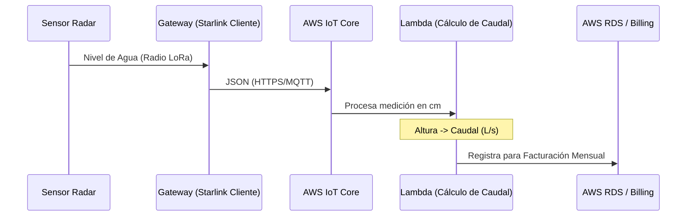

# Arquitectura AWS: Procesamiento e Integración de Facturación

Este documento describe el pipeline de datos en la nube de Amazon Web Services (AWS) para procesar la telemetría de caudales y automatizar la facturación.

## Pipeline de Datos

### 1. Ingesta y Seguridad (AWS IoT Core)
Los Gateways LoRaWAN, estableciendo salida a través de la infraestructura **Starlink provista por el cliente**, mantienen una comunicación cifrada vía MQTT con AWS IoT Core.
- **Protocolo**: MQTT sobre WebSockets (WSS) con certificados X.509.
- **Formato**: Payloads JSON estructurados.

### 2. Transformación de Caudal (AWS Lambda)
Lógica de cómputo serverless que intercepta los datos de nivel:
- **Cálculo de Aforo**: Conversión de *Distancia al Espejo de Agua (cm)* a *Caudal Instantáneo (L/s)* basado en la geometría del canal o tubería.
- **Compensación**: Ajuste algorítmico por variaciones ambientales.

### 3. Persistencia y Análisis (Timescale/RDS)
- **Series Temporales**: Almacenamiento optimizado para análisis histórico y auditoría del recurso hídrico.
- **Dashboard Operativo**: Visualización centralizada en Grafana.

### 4. Integración Billing (Módulo de Facturación)
Integración nativa con las **tablas de AWS del cliente** para la actualización de consumos acumulados, permitiendo una facturación precisa por volumen entregado.

## Diagrama de Flujo Lógico

