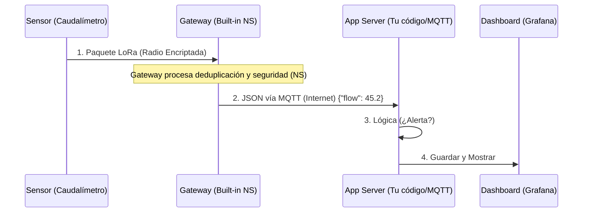

# Guía Técnica: Flujo de Datos LoRaWAN

Para entender cómo llega el dato de la represa a tu pantalla, imagina una carrera de postas con 4 corredores:

## 1. El Sensor (End-Device)
- **Función**: Mide el flujo de agua (pulsos) y lo convierte en un "mensaje de radio" (frecuencia LoRa).
- **Detalle**: El dato viaja encriptado y usando muy poca energía. No usa WiFi ni 4G directo desde el sensor.

## 2. El Gateway (Puerta de Enlace)
- **Función**: Es un "oyente" profesional. Escucha el mensaje de radio del sensor y lo pasa a Internet (vía 4G/WiFi/Ethernet).
- **¿Es inteligente?**: Poco. Solo traduce "Radio -> Internet". Es como el modem de tu casa, pero para LoRa.

## 3. El Network Server (Cerebro de la Red)
- **¿Qué es?**: Aquí es donde vive la "magia". El NS recibe el dato del Gateway.
- **Tareas Técnicas**:
    - **Deduplicación**: Si tienes 2 Gateways y ambos escuchan al mismo sensor, el NS descarta el mensaje repetido.
    - **Seguridad**: Desencripta el mensaje usando las llaves de seguridad.
    - **Gestión**: Le dice al sensor si debe subir o bajar la potencia de radio (ADR - Adaptive Data Rate).
- **¿Dónde vive?**:
    - **Integrado (Built-in)**: Viene "dentro" del software del Gateway (ej. Milesight/Dragino lo traen de fábrica). Es ideal para un sitio único como la represa.
    - **Externo (Nube)**: Vive en un servidor aparte (como ChirpStack o TTN). Ideal para redes gigantes que cubren ciudades.

## 4. El Application Server (Lógica de Negocio)
- **Función**: Toma el dato "limpio" y lo guarda o muestra.
- **Ejemplo**: "El flujo es de 50L/s". Aquí es donde programamos que si baja de 10L/s, se mande un WhatsApp o se guarde en base de datos.

---

### Diagrama de Flujo Técnico (Ejemplo Integrado)

