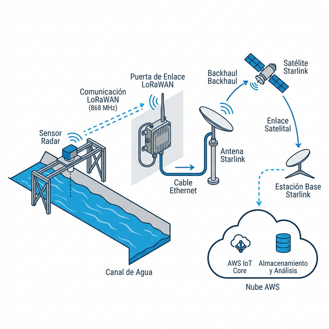

# Propuesta Técnica: Telemetría de Caudales y Aguas
**Modernización de Canales - Valle de Colchagua**

---

### 📋 Resumen Ejecutivo
- **Referencia**: PR-COL-V2
- **Fecha**: 17 de Marzo, 2026
- **Vigencia**: 15 días corridos
- **Estado**: Final para Revisión

---

## 1. Esquema de Solución (Arquitectura)

> **Nota Técnica**: El sistema utiliza sensores radar de alta frecuencia y gateways LoRaWAN privados, eliminando la dependencia de redes móviles (5G/GSM) inestables en terreno. Los datos viajan vía Starlink hacia la nube de AWS para su centralización y análisis.

---

## 2. Etapa 0: Laboratorio y Calibración (Marcha Blanca)

Antes de cualquier instalación en terreno, realizamos un proceso de **Marcha Blanca** en entorno controlado para garantizar cero fallas en el despliegue.

- **Actividades**: Configuración de llaves EUI, pruebas de estrés (48h), pre-calibración de offsets de sensores.
- **Inversión Etapa 0**: **8.0 UF** (Costo Fijo inicial).

---

## 3. Comparativa de Alternativas Tecnológicas

A continuación, se presentan las dos opciones de equipamiento según el nivel de criticidad de la operación.

### Opción A: Industrial Pro
**Orientada a Continuidad Operativa**
45.0 UF (Equipamiento + Instalación)
*Punto de medición adicional: 18.5 UF*

- **Sensor**: Radar EM410-RDL (60GHz).
- **Gateway**: Exterior UG67 (IP67).
- **Control**: Vía NFC (Sin abrir equipo).
- **Vida Útil**: 8-10 años (Batería).

### Opción B: Estándar / Agnóstica
28.0 UF (Equipamiento + Instalación)
*Punto de medición adicional: 9.5 UF*

- **Sensor**: Ultrasónico LDDS75.
- **Gateway**: Compacto LPS8v2.
- **Protección**: Requiere resguardo físico.
- **Uso**: Ideal p/ validaciones rápidas.

## 4. Hoja de Ruta de Implementación (Roadmap)

| Hito | Actividad | Plazo Estimado |
| :--- | :--- | :--- |
| **HITO 0** | **Marcha Blanca**: Pruebas en laboratorio. | 2-3 días |
| **HITO 1** | **Red Core**: Instalación de Gateways en terreno. | 5 días hábiles |
| **HITO 2** | **Despliegue**: Montaje y calibración final. | 7 días hábiles |
| **HITO 3** | **Entrega y QA**: Validación de datos en AWS. | 5 días hábiles |

---

## 5. Consideraciones Finales
- **Infraestructura**: Starlink será provisto por la asociación/cliente.
- **Consultoría**: Incluye diseño de arquitectura y capacitación técnica inicial.
- **Impuestos**: Valores netos (No incluyen IVA).

---
*Documento generado para el Equipo de Ingeniería Consultora - Valle de Colchagua.*
